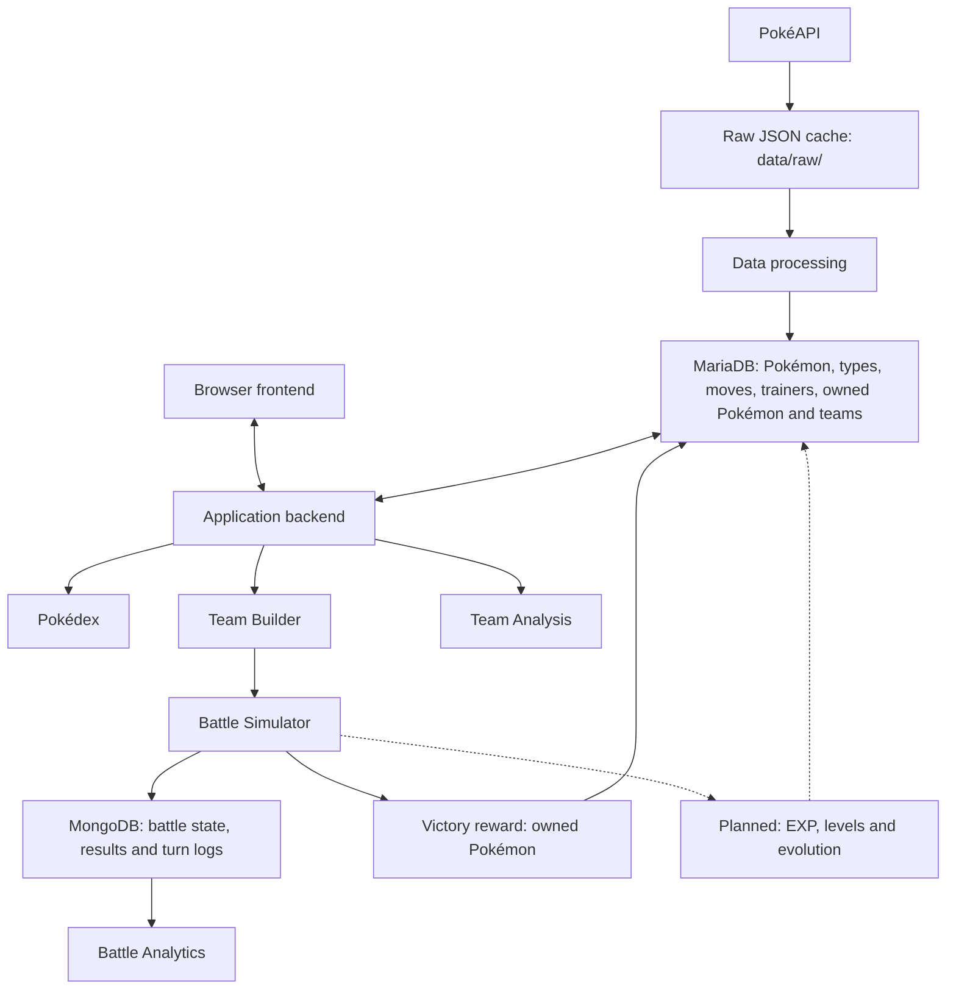

# Application architecture

The five core features share an application backend that reads structured data from MariaDB and stores battle history in MongoDB. The frontend accesses both databases through the backend.

Solid arrows describe the current prototype. Dashed arrows show proposed progression functionality, which is not implemented. Feature boxes represent backend responsibilities, not separate services or direct browser-to-database connections.

## Planned progression

EXP and levels would belong to each owned Pokémon, allowing two trainers' Charmanders to progress independently. Species data and evolution rules would describe the shared catalogue. Battle progression would be validated and saved to MariaDB by the backend; battle events and outcomes would remain in MongoDB for analytics.

Evolution rules, EXP awards, level thresholds and the corresponding schema changes still require design before implementation. This diagram does not define a final progression schema or change the current battle mechanics.

Raw PokéAPI responses remain preserved before transformation. Battle logs are generated by the simulator, separately from the PokéAPI dataset.
