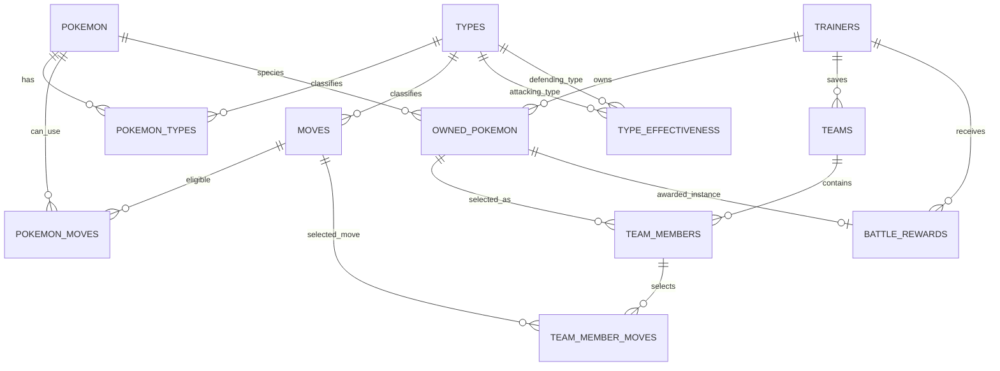

# Prototype relational relationships

Implemented in `database/relational/schema.sql`. Composite ownership foreign keys ensure a team's members belong to that team's trainer.

- Team slots are 1–6, move slots 1–4 and Pokémon type slots 1–2.
- Draft teams may be empty. Battle entry requires 1–6 members and four distinct eligible moves each.
- A trainer can own multiple instances of a species. The same owned instance cannot appear twice in one team.
- Unique `(team_id, trainer_id)` and `(owned_id, trainer_id)` references enforce ownership in SQL.
- Server-side transactional validation checks move eligibility and the four-move requirement.
- `battle_rewards.battle_id` is unique and references a MongoDB battle UUID logically; cross-database foreign keys are not available.
- MongoDB stores immutable team snapshots for history, mutable HP/PP for play, and flexible turn events. Deleting a saved team does not delete its battle history.
